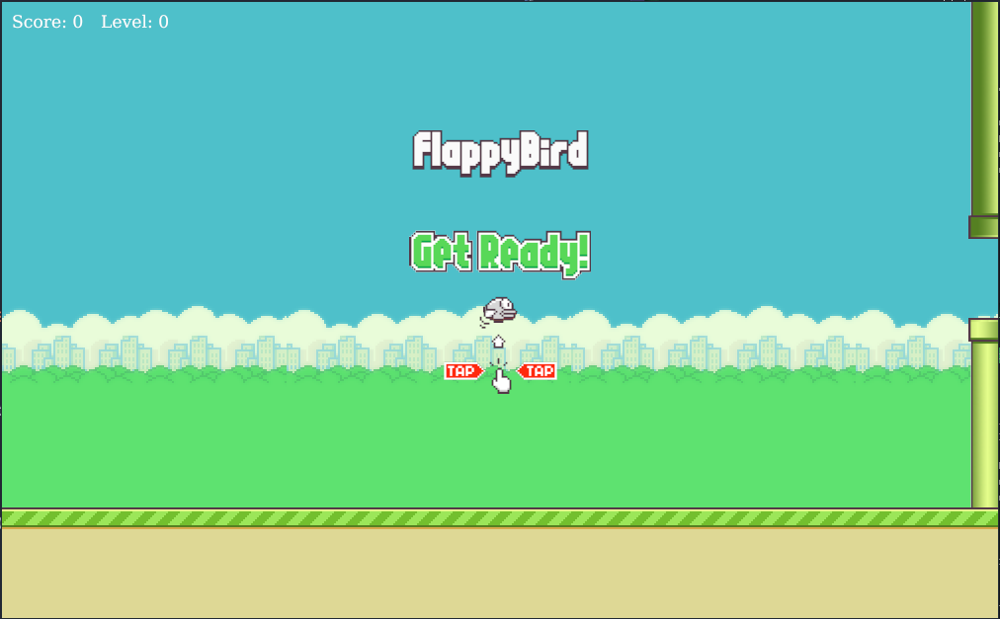
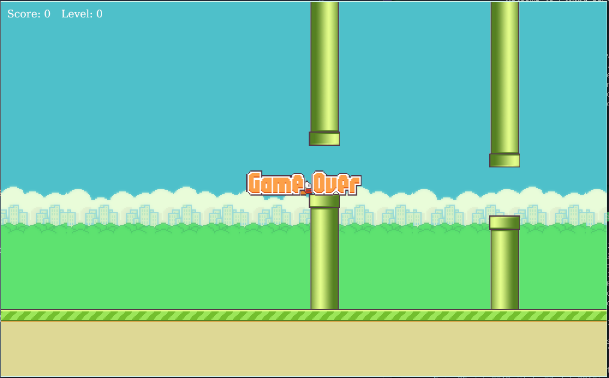

# Flappy Bird

Written in [ggez](https://github.com/ggez/ggez), this is a flappy-bird clone I'm working on because I haven't made a game in a very long time. That is all.

## Run

```bash
cargo run --release
```

## Install

```bash
cargo install
```

## Screenshots



